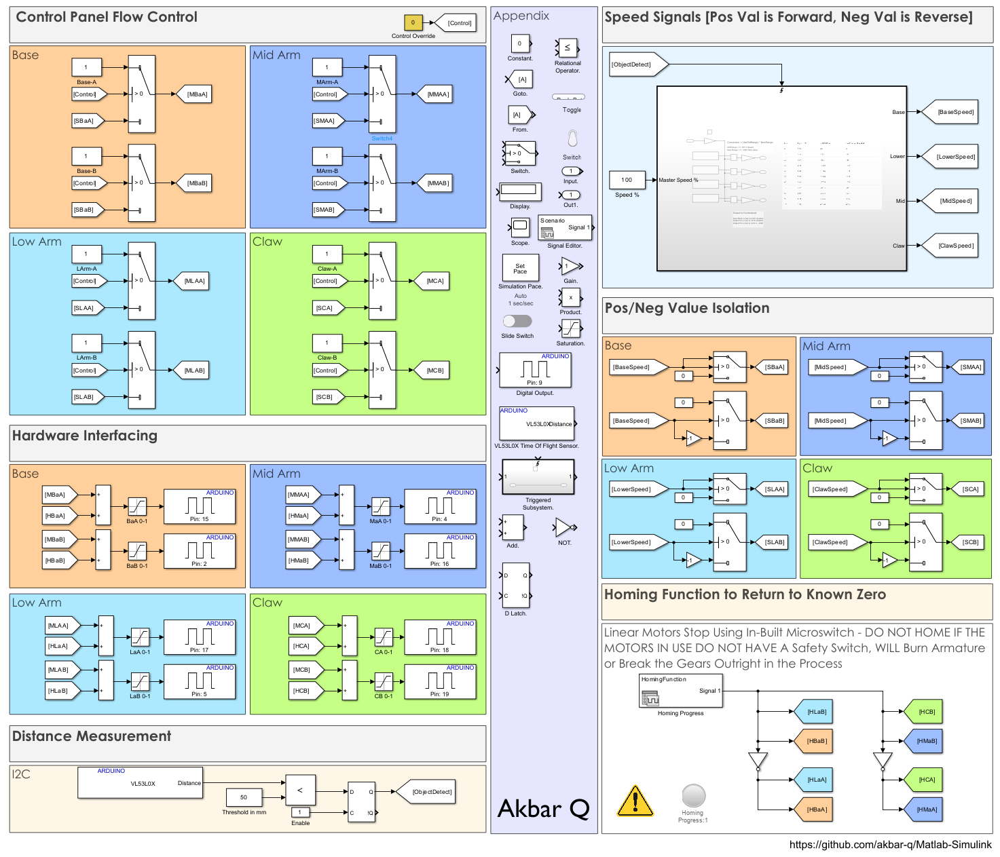
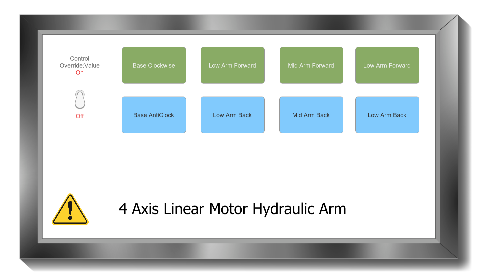
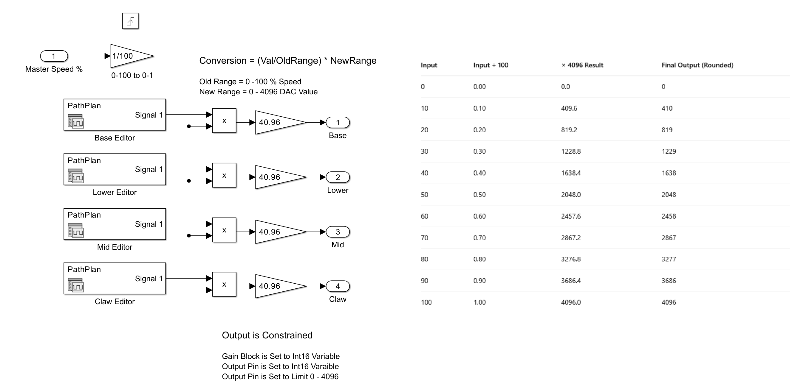

# 4-DOF Hydraulic Arm Kit Control System (Simulink - H-Bridge Motor Control)

This Simulink project implements a **bidirectional control system** for a 4-DOF hydraulic arm kit. Traditionally, the syringes in such a kit are moved manually by users to actuate the arm. In this design, the syringes are replaced with **linear motors**, which are driven using an **H-Bridge control strategy**. The full system provides both **manual control via a GUI panel** and **automated motion via a triggered speed-based subsystem**.

This simulation was developed using **MATLAB/Simulink R2024a** and requires the **Simulink Support Package for Arduino Hardware** to function, as the final implementation is for real hardware deployment.

---

## Overview

This block diagram shows the top-level system view.

- The system receives **speed commands** that control **4 H-Bridge motor channels**, each driving one linear actuator connected to the hydraulic arm's syringe.
- Each actuator corresponds to a specific degree of freedom: **Base rotation, Shoulder, Elbow, and Gripper (Z direction)**.
- Motion signals are routed either from:
  - A **manual control panel** (with buttons and toggles), or
  - A **triggered automatic movement subsystem** that executes pre-defined path plans.

---

## Signal Routing Breakdown

Each motor is controlled via an **H-Bridge**, which requires two set of signals signals:
- **A** (Clockwise)
- **B** (Anticlockwise)

The signal flow occurs as follows:

1. **Triggering Source**:
   - The system uses a **Distance Trigger** block to detect when a motion should begin (e.g., when the object is detected).
   - This sends a Boolean pulse to activate the automatic path planner and a D Latch is used to Keep the Value Held Down.

2. **Path Planning Subsystem**:
   - When triggered, this subsystem generates **constant velocity signals** for each axis (`vx`, `vy`, `vz`, and gripper rotation) for a **preset duration**.
   - Each signal goes to a corresponding **Speed Splitter** block.

3. **Speed to Direction Logic**:
   - The splitter logic converts signed speed inputs into:
     - **PWM magnitude** (always positive, passed to the Respective H-Bridge Pin),
     - **Direction bit** (1 = forward, 0 = reverse to Route the Signal).

4. **Signal Multiplexing**:
   - A **Signal Switch** is used to choose between:
     - The output of the **manual control panel**,
     - The **automatic triggered path** subsystem.
   - This allows smooth switching between manual control and auto-run sequences for debug and live development.

5. **Motor Driver Outputs**:
   - Final signals go to H-Bridge models or physical Arduino PWM-capable pins if deployed to hardware.
   - Signals are grouped as:
     - `PWM1`, `DIR1` → Motor 1
     - `PWM2`, `DIR2` → Motor 2
     - etc.

---

## Why This Structure?

- **Triggered Movement** is useful for path testing and hands-free demonstration of planned operations.
- **Manual Control Panel** is kept for real-time fine-tuning or during calibration phases.
- **Speed-Based Control** (instead of position control) allows the model to be compatible with open-loop systems that don’t rely on encoders.
- **Signal Routing via Switches** makes the model modular and expandable (e.g., adding sensor feedback in the future).

---

## Manual Reset Behavior

After each automatic sequence (e.g., movement for 5s in X, 3s in Y, etc.), **the Simulink model must be restarted manually** if you want to re-run the same trigger sequence.

### Why?

Simulink's **Signal Editor** blocks used to define velocity-time profiles **do not automatically reset to time = 0** after execution. Once the internal timeline completes, retriggering won’t re-execute the paths unless the model is **stopped and restarted**. Unfortunately, there’s no straightforward or elegant way to reinitialize these signal sources during runtime in Simulink without workarounds such as:

- Rewriting signal sources using MATLAB Function blocks and counters
- Replacing the Signal Editor with manual signal generators or tables
- Re-architecting the trigger block to act as a resettable FSM (future work)

**Any Contributions to Get Around this Issue will be Appreciated**

---

## More Diagrams

### Manual + Trigger Control Overview

---

### Trigerred Subsystem

This image shows the **Signal Editor** block contents for a triggered X-axis movement. The velocity signal (vx) is applied over a defined interval to simulate a move.

---

## 🛠️ Requirements

- MATLAB/Simulink **R2024a**
- **Simulink Support Package for Arduino Hardware** (for PWM-compatible deployment)
- Optional: Arduino Uno, H-Bridge motor drivers (e.g., L298N or DRV8871), 4 linear actuators

---

Let me know if you want to add:
- Motor calibration flow
- Reverse signal conditioning
- Support for joystick/encoder feedback

# Conversion Table: 0–100% to 0–4096 Scale for Reference

This table converts an input value in the range of 0 to 100 (representing a percentage) into a corresponding value in the range 0 to 4096 using the following formula:

Output = (Input ÷ 100) × 4096

| Input | Input ÷ 100 | × 4096 Result | Final Output (Rounded) |
|-------|-------------|---------------|-------------------------|
| 0     | 0.00        | 0.0           | 0                       |
| 10    | 0.10        | 409.6         | 410                     |
| 20    | 0.20        | 819.2         | 819                     |
| 30    | 0.30        | 1228.8        | 1229                    |
| 40    | 0.40        | 1638.4        | 1638                    |
| 50    | 0.50        | 2048.0        | 2048                    |
| 60    | 0.60        | 2457.6        | 2458                    |
| 70    | 0.70        | 2867.2        | 2867                    |
| 80    | 0.80        | 3276.8        | 3277                    |
| 90    | 0.90        | 3686.4        | 3686                    |
| 100   | 1.00        | 4096.0        | 4096                    |

## Notes
- The output is calculated by first dividing the input percentage by 100, then multiplying the result by 4096.
- The final output is rounded to the nearest integer for practical use, such as in digital resolution scaling or analog-to-digital conversion.