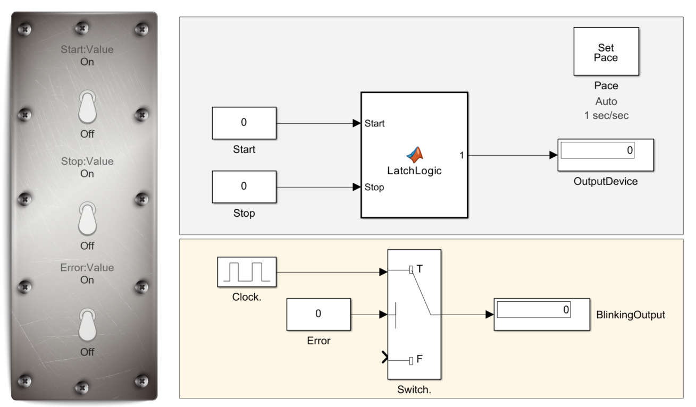

# Simulink Exercises – On/Off Latch & Blinky Warning Beacon

This repository contains a Simulink implementation of two basic control logic exercises commonly encountered in automation and PLC programming. The tasks are implemented together in a single Simulink model file for simplicity and demonstration purposes.

## File Structure

- `Exercise4_5_Model.slx` – Simulink model combining both the On/Off Latch and Blinky logic.

## Exercise 4 – On/Off Latch (Motor Start/Stop with Memory)

**Objective:**  
Control a motor (output `Y0`) using a start and stop push button setup with memory (latching).

**Inputs:**
- `X0` – Start button (momentary)
- `X1` – Stop button (momentary)

**Output:**
- `Y0` – Motor control signal

**Logic Description:**
- When the Start button is pressed (`X0`), the motor turns on and remains on even after the button is released.
- The motor remains running until the Stop button (`X1`) is pressed.

## Exercise 5 – Blinky (Warning Beacon for Fault Condition)

**Objective:**  
Blink a beacon light (output `Y0`) every 1 second when a fault condition is detected.

**Input:**
- `X0` – Fault signal (active high)

**Output:**
- `Y0` – Beacon light signal

**Logic Description:**
- When the fault condition is active (`X0` = 1), the beacon light (`Y0`) blinks on and off at a 1-second interval.
- When the fault condition is cleared (`X0` = 0), the beacon remains off.

## Requirements

- MATLAB R2022a or newer
- Simulink

## How to Run

1. Open MATLAB.
2. Open the provided `.slx` file in Simulink.
3. Use signal blocks or manual switch inputs to simulate `X0` and `X1`.
4. Run the simulation and observe the output behavior (`Y0`).

## Screenshots

## License

This project is for educational purposes and is released under the MIT License.
