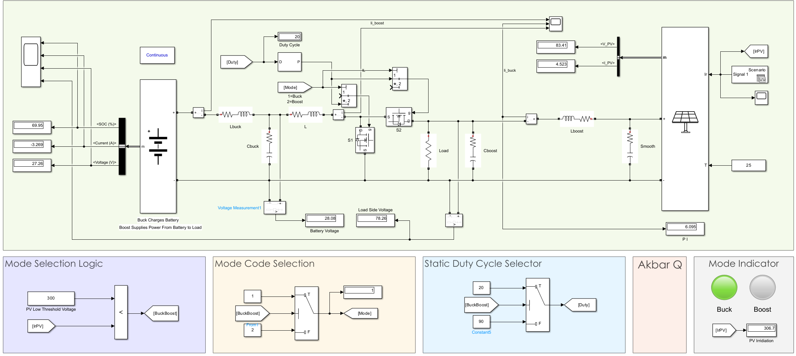

# Bidirectional DC-DC Converter with PV Array and Battery

This Simulink model simulates a **bidirectional DC-DC converter** that manages energy flow between a **PV array** and a **24V battery**, dynamically adjusting power direction based on **solar irradiation levels**. The model serves as a practical microgrid element for solar energy storage and load supply.

---

## System Overview

- **PV Array Side**: Acts as the energy source during high solar conditions.
- **Battery Side**: Stores energy or supplies power to the load.
- **Bidirectional Converter**: Operates in buck or boost mode depending on solar input.

### Operating Modes

| Mode   | Irradiation (Ir) Condition | Power Direction           | Converter Mode |
|--------|-----------------------------|----------------------------|----------------|
| Buck   | `Ir > 300 W/m²`             | PV → Battery               | Charging       |
| Boost  | `Ir ≤ 300 W/m²`             | Battery → Load            | Discharging    |

---

## Simulink Model Structure

### Battery Block (Left)

- Displays battery **State of Charge (SOC)**, **Voltage**, and **Current**.
- Power flows into or out of the battery depending on the converter mode.

### PV Array (Right)

- Generates voltage and current based on **irradiation** and **temperature inputs**.
- Smoothed with an LC filter to reduce noise.

### Mode Selection & Duty Control (Bottom Panels)

- **Mode Logic**: Compares current irradiation against a threshold (300 W/m²).
- **Mode Code Selector**: Switches between Buck (1) and Boost (2).
- **Duty Cycle Selector**: Applies a preset duty cycle (e.g., 20% buck, 90% boost) based on mode.
- **Visual Indicator**: Lights up the active mode (Buck or Boost).

### Power Electronics Section (Middle)

- Switches **S1** and **S2** controlled based on current mode.
- Separate inductors and capacitors used for Buck (`Lbuck`, `Cbuck`) and Boost (`Lboost`, `Cboost`) operation.
- Power flow monitored at load and battery side using scopes and displays.

---

## Observed Parameters

- **Battery Voltage** (e.g., 28.08V)
- **Load Voltage** (e.g., 78.26V)
- **PV Voltage / Current**
- **PV Irradiation** (e.g., 306.7 W/m²)
- **Current Flow in Buck/Boost Mode**
- **Duty Cycle**

---

## Control Logic Snapshot

- If PV Irradiation (`IrPV`) > 300 → Enter **Buck Mode**
  - Fixed duty cycle of 20%
  - Charge battery from PV
- Else → Enter **Boost Mode**
  - Fixed duty cycle of 90%
  - Discharge battery to load

---

## Applications

- Solar-powered systems with intelligent battery management.
- Educational simulation of bidirectional converters in microgrid contexts.
- Testing the effect of real-time solar conditions on power flow and battery life.

---

## Included Files

- `bidirectional_converter_model.slx` – Main simulation file.
- `RampUpDown.mat` – PV Ramp Signal.

---

## Notes

- Temperature is set to 25°C by default.
- Static duty cycle is used for demonstration; advanced PWM or MPPT can be integrated.
- Battery current can be negative (charging) or positive (discharging) depending on mode.

---

## License

This project is shared for educational and academic reference purposes only.