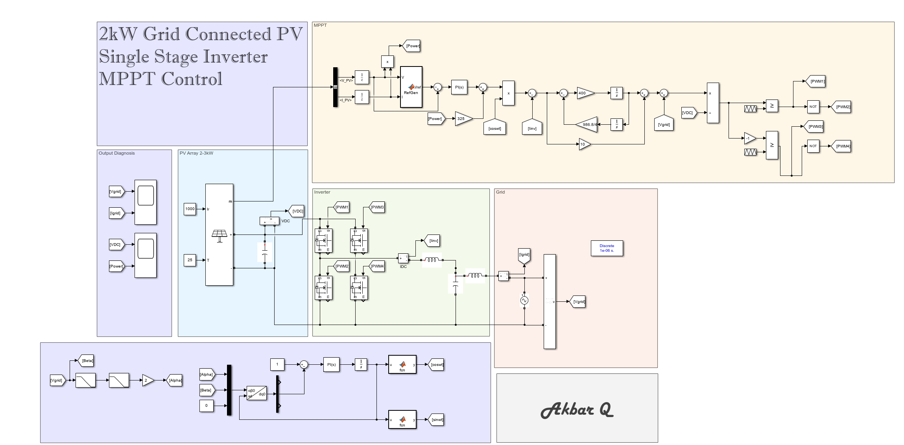

# 2kW Grid-Connected PV Single-Stage Inverter with MPPT Control

This repository contains a Simulink implementation of a **2kW Grid-Connected Photovoltaic (PV) Inverter** with **Single-Stage Conversion** and **MPPT (Maximum Power Point Tracking)**. Developed in **MATLAB Simulink R2024a**, this project provides a high-level simulation of a real-world solar inverter using standard control strategies for power extraction and grid interfacing.



---

## About

This model demonstrates:
- A PV array operating between 2–3kW with realistic IV characteristics.
- MPPT control using a custom-written Perturb and Observe (P&O) algorithm.
- DC-AC inversion for single-stage grid-tied operation.
- Grid synchronization and current injection.
- Diagnostic outputs for current, voltage, and power tracking.

All models are open-source and free to download. The primary development environment is MATLAB R2024a. You are welcome to suggest improvements or submit documentation enhancements.

---

## File Structure

- `/models/` — Contains `.slx` and associated MATLAB files.
- `/images/` — Screenshots and diagrams for documentation.
- `RefGen.m` — MPPT control logic implemented in MATLAB.
- `README.md` — Project documentation.

---

## MPPT Algorithm

This project uses a **Perturb and Observe (P&O)** algorithm to track the maximum power point of the PV array. The controller outputs a reference voltage (`Vref`) that is dynamically adjusted based on real-time current and voltage measurements of the PV system.

### `RefGen` MATLAB Function

```matlab
function Vref = RefGen(V, I)

Vrefmax = 550;
Vrefmin = 0.0;
Vrefinit = 420;
deltaVref = 1;
persistent Void Poid Vrefold;

if isempty(Void)
    Void = 0;
    Poid = 0;
    Vrefold = Vrefinit;
end

P = V * I;
dV = V - Void;
dP = P - Poid;

if dP ~= 0
    if dP < 0
        if dV < 0
            Vref = Vrefold + deltaVref;
        else
            Vref = Vrefold - deltaVref;
        end
    else
        Vref = Vrefold + deltaVref;
    end
else
    Vref = Vrefold;
end

if Vref >= Vrefmax || Vref <= Vrefmin
    Vref = Vrefold;
end

Vrefold = Vref;
Void = V;
Poid = P;

Simulation Components
Block Group	Description
PV Array	Simulates PV voltage-current behavior under irradiation.
MPPT	Custom MATLAB function block dynamically generating Vref.
Inverter	Full-bridge converter controlling DC-AC conversion using PWM.
Grid	Simulated grid system with current injection and feedback.
Diagnostics	Displays voltage, current, and output power live.
Truth Table for MPPT Adjustment Logic
ΔP (dP)	ΔV (dV)	Action on Vref
+	+	Increase
+	–	Increase
–	+	Decrease
–	–	Increase
0	x	Hold previous value
License

This project is open-source under the MIT License. Attribution is appreciated but not required.