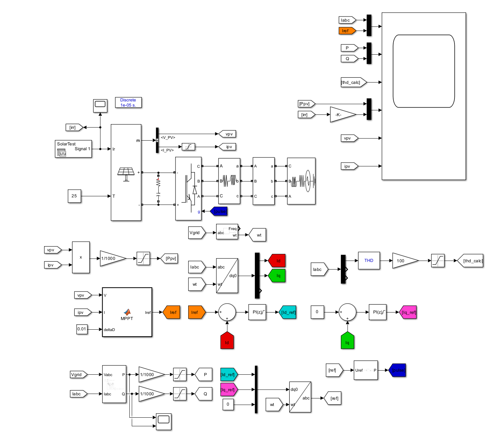

# Grid-Connected PV Inverter with Single-Stage MPPT (2kW)

This repository features two MATLAB Simulink (R2024a) models of a **2kW Grid-Connected Photovoltaic (PV) System** with **Single-Stage Inversion** and **MPPT Control** Make Sure to Load the Variables and Irridiation Plot:

The model simulates a practical PV inverter setup, including MPPT tracking, inverter control, and grid synchronization.

---

##  Diagram



---

##  File Structure

```text
/
├── RefGen.m         # Voltage-based MPPT algorithm
├── MPPT.m           # Current-based MPPT algorithm
├── *.slx            # Simulink model files
├── *.png            # System diagrams
└── README.md        # This file

 MPPT Implementations
1. Voltage-Based MPPT (RefGen.m)

This Perturb & Observe (P&O) function adjusts the reference voltage Vref to operate near the PV module's maximum power point.

function Vref = RefGen(V, I)

Vrefmax = 550;
Vrefmin = 0.0;
Vrefinit = 420;
deltaVref = 1;
persistent Void Poid Vrefold;

if isempty(Void)
    Void = 0;
    Poid = 0;
    Vrefold = Vrefinit;
end

P = V * I;
dV = V - Void;
dP = P - Poid;

if dP ~= 0
    if dP < 0
        if dV < 0
            Vref = Vrefold + deltaVref;
        else
            Vref = Vrefold - deltaVref;
        end
    else
        Vref = Vrefold + deltaVref;
    end
else
    Vref = Vrefold;
end

if Vref >= Vrefmax || Vref <= Vrefmin
    Vref = Vrefold;
end

Vrefold = Vref;
Void = V;
Poid = P;

2. Current-Based MPPT (MPPT.m)

This implementation uses current control and dynamically generates an Iref to regulate the inverter output, especially useful when current is directly controllable.

function Iref = MPPT(V, I, deltaD)

Iref_init = 0.1;
Imin      = 0;
I_max     = 150;

persistent Vold Pold Iref_old;

if isempty(Vold)
    Vold = 0;
    Pold = 0;
    Iref_old = Iref_init;
end

P = V * I;
dV = V - Vold;
dP = P - Pold;
Iref = Iref_old;

if dP ~= 0 && V > 400
    if dP < 0
        if dV < 0
            Iref = Iref_old - deltaD;
        else
            Iref = Iref_old + deltaD;
        end
    else
        if dV < 0
            Iref = Iref_old + deltaD;
        else
            Iref = Iref_old - deltaD;
        end
    end
end

if Iref >= I_max
    Iref = I_max;
end

if Iref < Imin
    Iref = I_max;
end

Iref_old = Iref;
Vold = V;
Pold = P;

 Control Flow Summary
ΔP (dP)	ΔV (dV)	RefGen Action	MPPT Action
+	+	Increase Vref	Decrease Iref
+	–	Increase Vref	Increase Iref
–	+	Decrease Vref	Increase Iref
–	–	Increase Vref	Decrease Iref
 Requirements

    MATLAB R2024a

    Simulink

    Optional: Simscape Electrical for enhanced visualization

 License

MIT License – free to use, modify, and distribute. Attribution is appreciated.
 Contact

Feel free to fork the project, raise an issue, or suggest improvements via pull request!