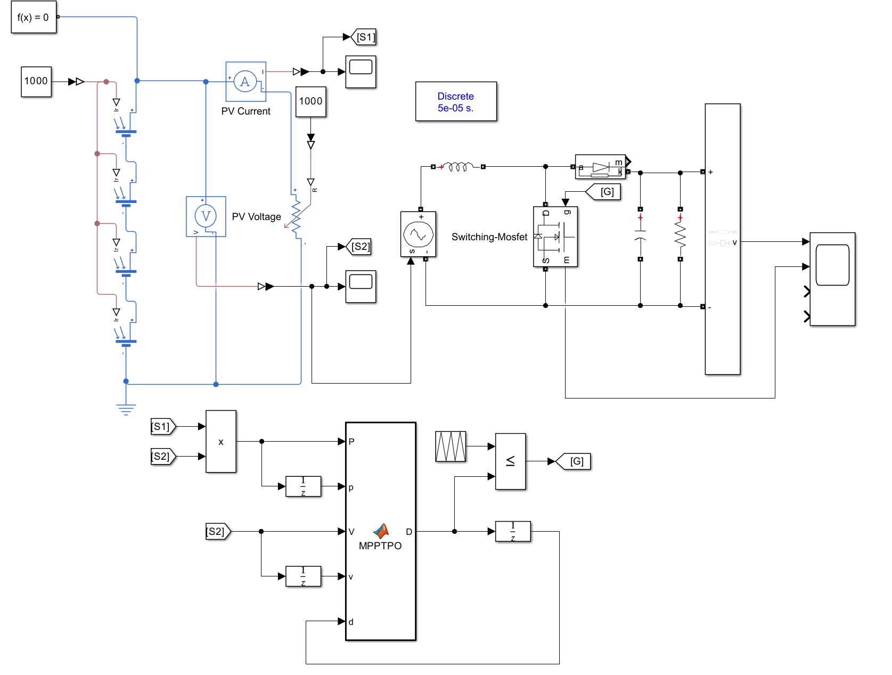

MPPT with Direct Duty Cycle Control (P&O Method)
Overview

This Simulink model implements a Perturb and Observe (P&O) MPPT algorithm by directly adjusting the duty cycle (D) of a DC-DC converter switch. It uses instantaneous voltage and current measurements to compute power, and updates the switching signal accordingly to maximize power extraction from a photovoltaic (PV) panel.
Key Features

    MPPT is implemented in a MATLAB Function block MPPTPO.m.

    Direct control over the converter’s duty cycle without intermediate current or voltage references.

    Power and voltage deltas are used to determine the direction of perturbation.

    Includes PV panel modeling, boost converter topology, and a resistive load.

    Discrete simulation with a fixed time step of 50 μs.

Simulink Diagram

MPPT Function Code: MPPTPO.m

function D = MPPTPO(P, p, V, v, d)

dp = P - p;
dv = V - v;
d = 0.58;

if (dp > 0)
    if (dv < 0)
        D = d + 0.05;
    else
        D = d - 0.05;
    end
else
    if (dv < 0)
        D = d - 0.05;
    else
        D = d + 0.05;
    end
end

Notes

    The output duty cycle D is updated based on the relative change in power (dp) and voltage (dv) from one time step to the next.

    The default duty cycle is initialized to 0.58 at every function call — for persistent operation, this may be extended to include memory of d using persistent variables.

    This version assumes boundary limits for D are handled outside the function (e.g., saturation or clipping).